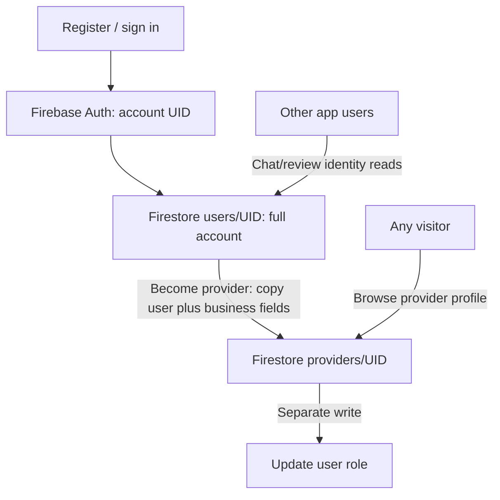
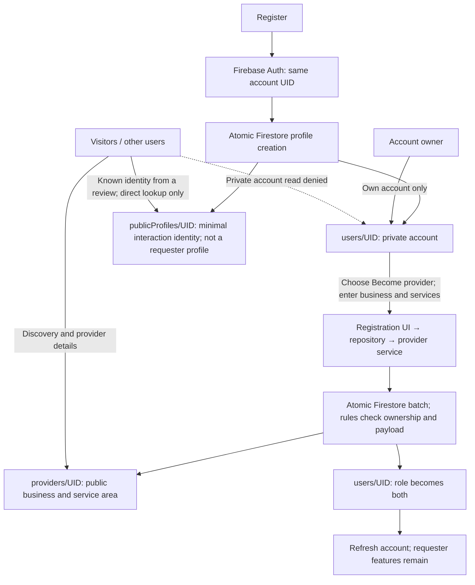
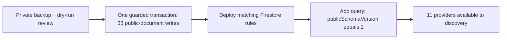

# Public/private profiles: what changed (S01)

**Purpose:** keep the same requester/provider functionality while stopping private account data from being exposed. Implementation and live migration completed September 18, 2026; PR review and final native acceptance remain open.

## Before

The rules allowed any signed-in user to read full user documents, and anyone to read providers. Copying a user into a provider also copied phone, DOB, bookmarks, and account fields. Hiding those fields in the UI did not stop direct database reads. The two separate enrollment writes could also partially succeed.

## After: same person, separate visibility

A provider keeps the same UID, bookmarks, bookings, messages, and requester reviews. Only public fields are copied into the business document. Editing a business still works; editing an account name synchronizes the private account, interaction identity, and existing provider name in a transaction. Firebase Admin operations remain server-authorized. Earnings reads are scoped to their provider owner.

`publicProfiles` is the current collection name, but it does not represent a browsable requester profile. It is a small identity projection used when a requester appears in a booking, conversation, or review. A caller may directly fetch a known identity so a guest can see the name attached to a public review. Collection listing is denied, so requesters cannot be browsed or searched like providers.

## Main code changes

| Area | Change and reason |
| --- | --- |
| `Provider.ts`, `PublicProfile.ts`, `types/provider.ts` | Explicit database visibility models replace `Provider extends User`. Embedded services are modeled because profiles and booking already use them. Personal phone stays in the private user, not the public view model. |
| `providerRepository.ts`, `providerService.ts` | `createOrUpdateProviderProfile` still exists. It selects `createProviderAndPromote` for enrollment or `updateProvider` for editing. The former `createOrUpdateProvider` plus separate `updateUserRole` calls are replaced, not lost. |
| `authService.ts`, `contexts/auth.tsx` | Create/synchronize public identity alongside the private profile; clear refresh loading on failure. |
| `publicProfileService.ts`, chat/review adapters | Resolve other people's display identity without reading their private accounts. |
| Location picker, search, EN/FR copy | Publish approximate service coordinates, retain city/country, and explain distance limitations; private account location is not a fallback. |
| `firestore.rules`, migration/test scripts | Enforce the document boundaries, clean legacy records, and verify legitimate flows plus access denial. Scripts run as operator tools, not deployed Cloud Functions. |

## Live database: before → after

| Collection | Before | After |
| --- | --- | --- |
| `users` | 22 full accounts; authenticated-wide reads | Same 22 accounts, unchanged by migration; owner-only client reads |
| `providers` | 11 business documents mixed with private account fields | Same 11 businesses/services retained; private copies removed; `publicSchemaVersion: 1`; approximate coordinates |
| `publicProfiles` | 0 documents | 22 minimal public display identities |
| `earnings` | Authenticated-wide reads | Provider-owner-only client reads; no earnings data migration |

The empty discovery screen came from running the updated query **before migration**: zero legacy records had the required marker. Migration restored the results without reopening private reads. Only Firestore rules were deployed; no Functions or Storage deployment.

## Verified and still open

- Passed: TypeScript, security/role-transition emulator tests, migration/atomicity tests, identity direct-read/list-denial tests, earnings owner/outsider/anonymous tests, and live discovery/public-access checks. Lint: 0 errors, 61 existing warnings. Backup comparison confirmed private users and provider business data were preserved.
- Native two-account smoke passed on iPhone 15 / iOS 17.5: requester discovery, sanitized provider detail, enrollment validation, booking entry, chat, completed history, review form, and reviewer identity loaded; the provider dashboard, requester capabilities, bookings/chat, owner profile, edit prefill, and role persistence after reload also passed. The actual requester-to-provider transition passes the emulator regression suite; disposable record-creating native automation is tracked under E04 release validation rather than leaving S01 open. The historical-exposure inventory is recorded in the rollout notes. Five legacy providers need their owners to add services; new portfolio uploads and trusted rating aggregation are separate backlog items.
- Old clients using private cross-account reads or unfiltered provider queries need updating. Private recovery snapshots are Git-ignored and must never enter the PR.

See [release readiness](release-readiness.md) for status and [rollout/recovery notes](public-private-profile-rollout.md) for deployment evidence and commands.
